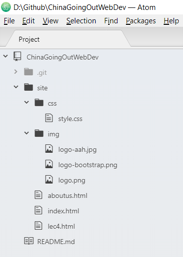

# Lecture 4 BootStrap

## Links

[GitHub Pages](https://vwslz.github.io/ChinaGoingOutWebDev/site/aboutus.html)

[A showcase of the website](https://drive.google.com/file/d/16nw2LyODtp9Tk5xx1Jx3xAqkrTfFOMEp/view)

## Instruction

1. On the top right of the page, fork the current project. The page will jump to your own project after a while.

2. Open Atom.

2. Pres Ctrl + Shift + P and select GitHub: Clone.

3. Enter https://github.com/YOUR_USERNAME/ChinaGoingOutWebDev.git for Clone from. （replace YOUR_USERNAME with your GitHub username）

4. Press Clone button.

- (If your clone in Atom failed, you can download GitHub Desktop to clone.)

- (If you have the project panel shown as the following, skip step 5.)

5. File -> Add Project Folder.. -> Select the folder that you cloned to.

## Congratulations!

Now you are ready for Lecture 4: BootStrap.

If you have any problem with the instruction, please DON'T hesitate to ask.

## Assignment

Continue working on html file as what we did during the lecture. The final version of your site should be similar to the shown. You can customize your own CSS style.

## Submit

(Set up GitHub Page in browser)

1. On your own GitHub project home page, go to *Setting*.

2. Scroll down to *GitHub Pages* section. For *Source*, select *master branch*.

(Update the project on GitHub in Atom)

1. Packages -> GitHub -> Toggle Git Tab

2. Press *Stage All* to stage all the changes.

3. Enter commit message and press *Commit to master* button.

4. At the bottom press *push* to update.
